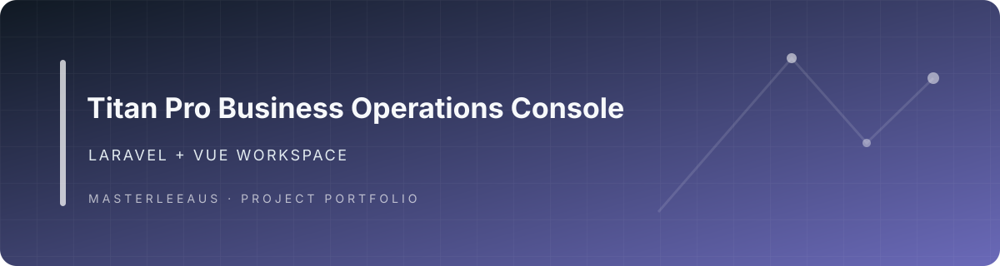

<div align="center">

# Titan Pro Business Operations Console

**A Laravel and Vue application workspace in the Titan product family.**

</div>

## Product architecture and engineering highlights

A broad Laravel business-operations platform that brings field service, CRM, finance, workforce, communications, and customer-facing surfaces into one modular application.

- **Architecture:** Laravel 12 and Filament 4 provide the backend/admin foundation; Inertia and Vue power the web interface; separate Web, Mobile, and PWA trees sit beside more than 40 business modules.
- **Distinctive engineering:** The module set spans CRM, booking, cleaning jobs, quoting, dispatch, payroll, accounting, supply chain, customer portal, payments, messaging, AI, and owner/field interfaces. The architecture’s standout is one modular domain platform serving multiple product surfaces.

> **Status: project identity and relationship under review.** The repository contains a substantial Laravel application and Mobile source tree. Its current product role and relationship to Titan Zero Field Service Workforce were not established by the inspected default-branch files.

## Repository overview

- Primary application: Laravel
- Frontend tooling: Vite, Vue/Inertia, Tailwind CSS
- Test tooling: Vitest
- Root scripts are defined in `package.json`.

This landing page does not claim that the application builds, passes tests, or is production-ready; those checks were not run during this portfolio review.

## Local development

Review `.env.example` and the Composer manifests, configure a local environment, then use the checked-in scripts:

```bash
composer install
npm install
npm run dev
```

For production assets, the repository defines `npm run build`. The available npm checks include:

```bash
npm test
npm run format:check
```

Verify each command against the current source and deployment environment before relying on it.

## Portfolio classification

**Needs owner and lineage confirmation.** Compare against [Titan BOS](https://github.com/Masterleeaus/Titan-BOS), [cleanly](https://github.com/Masterleeaus/cleanly), [modules](https://github.com/Masterleeaus/modules), and the [current workforce platform](https://github.com/Masterleeaus/Titan-Zero-Field-Service-Workforce). Keep it as a separate portfolio project only if it has a distinct purpose or valuable, attributable implementation.

## Security and provenance

The root `LICENSE` identifies MIT terms and names Michael Stoffer as copyright holder. Preserve that attribution. Never commit production secrets, customer data, or local environment files. Confirm ownership and upstream provenance before presenting this repository as original work or redistributing modified code.

## Banner

A checked-in project-specific banner is displayed above.

## Engineering guide

See [docs/PORTFOLIO.md](docs/PORTFOLIO.md) for the repository-specific code map, quickstart, evidence boundaries, and limitations.
